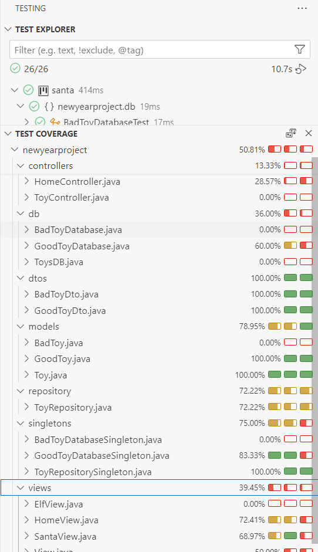
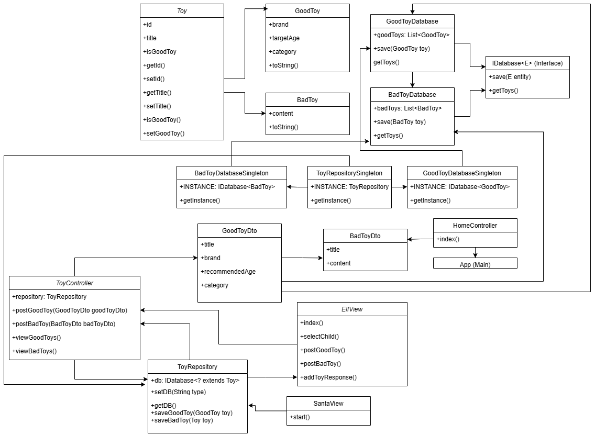

## Project-Santa-Claus-Toy-Factory

**Project in dev**

## Project Description
The Santa Toy Factory is a console-based application designed to manage toy inventory, structured using the MVC (Model-View-Controller) architecture. This application enables Santa's elves to register, view, and delete toys, while Santa can review toy lists and export them as CSV files.

## Main Features

**For Elves:**

Add Toys:
Register toys for good children (including title, brand, age range, and category).
Register toys for naughty children (including title and content).
View All Toys:
View a list of all registered toys in the inventory.
Delete Toys:
Remove toys from the inventory as needed.
Log Out:
Exit the session when done.

**For Santa:**

View Toys for Good Children:
Review a list of toys designated for good children.
View Toys for Naughty Children:
Review a list of toys designated for naughty children.
Save Toys to CSV:
Export the full list of toys to a CSV file.
Log Out:
Exit the session when done.


## Prerequisites
- **Java Development Kit (JDK) 8** or higher - Required to compile and run the project.
- **Maven** - If you want to manage dependencies or compile from the command line.
- **IDE** - For better management of the project and its dependencies.

## Installation steps
1. **Clone the repository**
    ```bash
    git clone https://github.com/Snysic/Proyecto---Santa-Claus-Toy-Factory.git
    cd Proyecto---Santa-Claus-Toy-Factory
    ```

2. **Set up the project in the IDE**
    - Open the project in your preferred IDE.
    - Ensure the JDK is configured correctly.
    - Verify the `pom.xml` file is present, as well as the dependencies.

3. **Run the application**
    - Navigate to the `App` class in your IDE.
    - Run the `App` class from the IDE, or from the terminal.

4. **Menu Options**
    Within the app, you will be presented with various options to manage toys . You can add, view, delete, and filter toys. Select the number corresponding to the option you wish to choose, ranging from 1 to 6.

## Test Execution

In Visual Studio Code, navigate to the **Testing** section to run tests and observe code coverage. The project ensures a minimum of 70% coverage across all methods.



You can also find the test coverage image here: `images/test-cover.png`

## Project Structure

## Activity diagram


## Class diagram



## Author
- Maria Vasilenko


